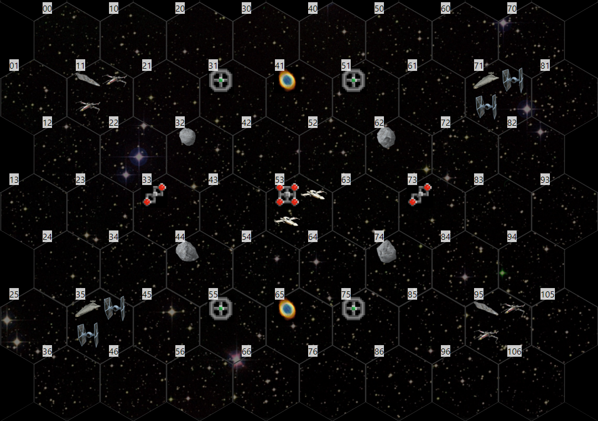

# The Exenia Campaign

The Exenia Campaign is strategic map campaign system for four players in [Star Wars: X-Wing Second Edition](https://www.fantasyflightgames.com/en/products/x-wing-second-edition/).

* [Overview](#overview)
* [Map](#map)
* [Map Features](#map-features)
* [Key Concepts](#key-concepts)
   * [Fuel](#fuel)
   * [Supply](#supply)
   * [Readiness](#readiness)
* [Setup](#setup)
   * [Rebel Carriers](#rebel-carriers)
   * [Imperial Carriers](#imperial-carriers)
   * [Rebel Starfighter Wings](#rebel-starfighter-wings)
   * [Imperial Starfighter Wings](#imperial-starfighter-wings)
* [Carrier Status Sheet](#carrier-status-sheet)
* [The Strategic Turn](#the-strategic-turn)
   * [1. Carrier Movement](#1-carrier-movement)
   * [2. Starfighter Sortie](#2-starfighter-sortie)
   * [3. Battle Resolution](#3-battle-resolution)
   * [4. Resource Collection](#4-resource-collection)
   * [5. Strategic Preparations](#5-strategic-preparations)
* [Ending The Campaign](#ending-the-campaign)
* [Exenia Battle Format](#exenia-battle-format)

***

 

## Overview

[Watch the opening crawl!](https://njablonski.github.io/ExeniaCampaign/)

In the Exenia Campaign, each player controls a Carrier starship with a large complement of classic Star Wars starfighters from the original trilogy and [Legends](https://starwars.fandom.com/wiki/Star_Wars_Legends) stories. The campaign plays out over a series of strategic turns, during which players will move their Carriers, sortie their Starfighter Wings, resolve battles with games of [Star Wars: X-Wing Second Edition](https://www.fantasyflightgames.com/en/products/x-wing-second-edition/), and attempt to collect enough Fuel from Black Sun refineries to safely return to known space.

The campaign features two factions, the Rebel Alliance and the Galactic Empire, and players will each be part of a two-person team representing one of the factions.

Strategic turns are tracked on a hex map, which can be managed on [HexTML](https://hextml.playest.net/) using the [provided files](https://raw.githubusercontent.com/njablonski/ExeniaCampaign/master/assets/starting_map.html), or tracked with pen and paper or other software.

***

 

## Map

The size of the map is 68 hexes, arranged in alternating rows of length 8 and 9.

See the example map below, which shows the state of the map at the beginning of the campaign.

Using the hex numbering from the example image, you should mark the following features on the listed map locations:

<table class="tg">
<thead>
  <tr>
    <th class="tg-0lax"><b>Hexes</b></th>
    <th class="tg-0lax"><b>Feature</b></th>
  </tr>
</thead>
<tbody>
  <tr>
    <td class="tg-0lax">11, 95</td>
    <td class="tg-0lax">Rebel Start</b></td>
  </tr>
  <tr>
    <td class="tg-0lax">35, 71</td>
    <td class="tg-0lax">Imperial Start</b></td>
  </tr>
  <tr>
    <td class="tg-0lax">31, 51, 55, 75</td>
    <td class="tg-0lax">Fabricator Outpost</b></td>
  </tr>
  <tr>
    <td class="tg-0lax">33, 73</td>
    <td class="tg-0lax">Secondary Refinery</b></td>
  </tr>
  <tr>
    <td class="tg-0lax">53</td>
    <td class="tg-0lax">Main Refinery</b></td>
  </tr>
  <tr>
    <td class="tg-0lax">32, 62, 44, 74</td>
    <td class="tg-0lax">Asteroid Field</b></td>
  </tr>
  <tr>
    <td class="tg-0lax">65, 41</td>
    <td class="tg-0lax">Energized Gas Cloud</td>
  </tr>
</tbody>
</table>

***

 

## Map Features

***

 

## Key Concepts

The following terms and concepts are important to understand when playing the Exenia Campaign.

### Fuel

The objective of the Exenia Campaign is to collect enough Coaxium hyperdrive Fuel from the Black Sun Refineries to return both of your team's carriers to the known galaxy. Fuel is collected by Carriers or Starfighter Wings that control Refineries during the _Resource Collection_ phase of a strategic turn.

Fuel can be spent during the _Carrier Movement_ phase of a strategic turn to increase your carrier's hyperdrive speed, which allows it to move an additional hex.

### Supply

Supply represents various consumable resources. The forces in the Exenia Campaign are far away from typical Rebel or Imperial logistical support, and must be judicious about their use of scarce materials. Additional Supply can be gathered by Carriers or Starfighter Wings that control Fabricator Outposts during the _Resource Collection_ phase of a strategic turn.

In the _Battle Resolution_ phase of a strategic turn, players can spend Supply on _Ordnance_ and _Personnel_ to allow their starfighters to take additional upgrades.

In the _Strategic Preparations_ phase, Carriers that were not involved in battles and Starfighter Wings that did not Sortie can spend Supply on _Maintenance_ to increase their Readiness.

### Readiness

Readiness represents the condition of equipment and personnel needed to operate a Carrier or Starfighter Wing. There are four levels of Readiness, each with its own effect on a Carrier or Starfighter Wing:

<table class="tg">
<thead>
  <tr>
    <th class="tg-0lax"></th>
    <th class="tg-0lax"><b>3. Reinforced</b></th>
    <th class="tg-0lax"><b>2. Ready</b></th>
    <th class="tg-0lax"><b>1. Weakened</b></th>
    <th class="tg-0lax"><b>0. Grounded</b></th>
  </tr>
</thead>
<tbody>
  <tr>
    <td class="tg-0lax"><b>Carrier</td>
    <td class="tg-0lax">May sortie 2 Starfighter Wings</b></td>
    <td class="tg-0lax">May sortie 2 Starfighter Wings</b></td>
    <td class="tg-0lax">May sortie 1 Starfighter Wing</b></td>
    <td class="tg-0lax">May not sortie any Starfighter Wings</b></td>
  </tr>
  <tr>
    <td class="tg-0lax"><b>Starfighter Wing</b></td>
    <td class="tg-0lax">May field up to 170 points in battle</b></td>
    <td class="tg-0lax">May field up to 150 points in battle</b></td>
    <td class="tg-0lax">May field up to 130 points in battle</b></td>
    <td class="tg-0lax">Cannot sortie</b></td>
  </tr>
</tbody>
</table>

When the Galactic Empire or Rebel Alliance lose a battle, all of that team's involved Carriers and Starfighter Wings go down one level of Readiness.

If a Starfighter Wing does not sortie, it can spend 1 Supply on _Maintenance_ to increase its Readiness one level in the _Strategic Preparations_ phase. Similarly, in the _Strategic Preparations_ phase, if a Carrier was not involved in a battle during the current strategic turn, it can spend 1 Supply on _Maintenance_ to increase its Readiness one level.

***

 

## Setup

During setup, each player chooses which Carrier and Starfighter Wings he will control. You can randomize which player controls which carrier by having all players roll a d100, then in order of results from highest to lowest roll a d4, then a d3, then a d2, assigning remaining Carriers at each roll to numbers on the next dice.

### Rebel Carriers

- _**Paradise**_ ([Rebel MC80 Star Cruiser](https://starwars.fandom.com/wiki/MC80_Home_One_type_Star_Cruiser))
- _**Pursuit**_ ([Rebel MC80 Star Cruiser](https://starwars.fandom.com/wiki/MC80_Home_One_type_Star_Cruiser))

### Imperial Carriers

- _**ISD Gauntlet**_ ([Imperial Star Destroyer](https://starwars.fandom.com/wiki/Imperial-class_Star_Destroyer))
- _**ISD Nemesis**_ ([Imperial Star Destroyer](https://starwars.fandom.com/wiki/Imperial-class_Star_Destroyer))

The players who control the _**Paradise**_ and the _**Pursuit**_ will form the Rebel team, and the players who control the _**Gauntlet**_ and the _**Nemesis**_ will form the Imperial team.

Once Carriers have been chosen, each team should work together to assign Starfighter Wings to their Carriers. There are four Rebel Starfighter Wings and four Imperial Starfighter Wings. Each Carrier can host two Starfighter Wings. Once each team has assigned Starfighter Wings to their Carriers, you're ready to record your initial status and begin the first strategic turn. Carriers begin with 1 Fuel and 1 Supply.

### Rebel Starfighter Wings

<table class="tg">
<thead>
  <tr>
    <th class="tg-73oq">Name</th>
    <th class="tg-73oq" colspan="3">Starfighter Types</th>
  </tr>
</thead>
<tbody>
  <tr>
    <td class="tg-0pky"><b><i>Danger Wing</b></i></td>
    <td class="tg-0pky">T-65 X-Wing</td>
    <td class="tg-0pky">BTL-A4 Y-Wing</td>
    <td class="tg-0pky">Z-95 Headhunter</td>
  </tr>
  <tr>
    <td class="tg-0pky"><b><i>Enigma Wing</td>
    <td class="tg-0pky">T-65 X-Wing</td>
    <td class="tg-0pky">A/SF-01 B-Wing</td>
    <td class="tg-0pky">RZ-1 A-Wing</td>
  </tr>
  <tr>
    <td class="tg-0pky"><b><i>Outlaw Wing</b></i></td>
    <td class="tg-0pky">T-65 X-Wing</td>
    <td class="tg-0pky">RZ-1 A-Wing</td>
    <td class="tg-0pky">Z-95 Headhunter</td>
  </tr>
  <tr>
    <td class="tg-0lax"><b><i>Dynamo Wing</b></i></td>
    <td class="tg-0lax">T-65 X-Wing</td>
    <td class="tg-0lax">BTL-A4 Y-Wing</td>
    <td class="tg-0lax">A/SF-01 B-Wing</td>
  </tr>
</tbody>
</table>

### Imperial Starfighter Wings

<table class="tg">
<thead>
  <tr>
    <th class="tg-73oq">Name</th>
    <th class="tg-73oq" colspan="3">Starfighter Types</th>
  </tr>
</thead>
<tbody>
  <tr>
    <td class="tg-0pky"><b><i>Alpha Wing</b></i></td>
    <td class="tg-0pky">TIE/LN Fighter</td>
    <td class="tg-0pky">TIE/X1 Advanced</td>
    <td class="tg-0pky">TIE/IN Interceptor</td>
  </tr>
  <tr>
    <td class="tg-0pky"><b><i>Beta Wing</b></i></td>
    <td class="tg-0pky">TIE/LN Fighter</td>
    <td class="tg-0pky">TIE/SA Bomber</td>
    <td class="tg-0pky">TIE/PH Phantom</td>
  </tr>
  <tr>
    <td class="tg-0pky"><b><i>Gamma Wing</b></i></td>
    <td class="tg-0pky">TIE/LN Fighter</td>
    <td class="tg-0pky">TIE/PH Phantom</td>
    <td class="tg-0pky">TIE/IN Interceptor</td>
  </tr>
  <tr>
    <td class="tg-0lax"><b><i>Delta Wing</b></i></td>
    <td class="tg-0lax">TIE/LN Fighter</td>
    <td class="tg-0lax">TIE/X1 Advanced</td>
    <td class="tg-0lax">TIE/SA Bomber</td>
  </tr>
</tbody>
</table>

***

 

## Carrier Status Sheet

Throughout the game, players will need to track the status of their Carriers and Starfighter Wings. This status will change from one strategic turn to the next. To track the status of a Carrier, you need to record its Location, Readiness, Fuel, Supply, and the Readiness of its Starfighter Wings. See the example Carrier status sheet below.

<table class="tg">
  <tr>
    <td class="tg-0pky"><b>Name</b></td>
    <td class="tg-c3ow" colspan="2">ISD Gauntlet</td>
  </tr>
  <tr>
    <td class="tg-0pky"><b>Location</b></td>
    <td class="tg-c3ow" colspan="2">Hex 35</td>
  </tr>
  <tr>
    <td class="tg-0pky"><b>Fuel</b></td>
    <td class="tg-c3ow" colspan="2">1</td>
  </tr>
  <tr>
    <td class="tg-0pky"><b>Supply</b></td>
    <td class="tg-c3ow" colspan="2">1</td>
  </tr>
  <tr>
    <td class="tg-0lax"><b>Readiness</b></td>
    <td class="tg-baqh" colspan="2">Ready</td>
  </tr>
  <tr>
    <td class="tg-0lax" rowspan="3"><b>Fighter Wings</b></td>
    <td class="tg-0lax"><b>Name</b></td>
    <td class="tg-0lax"><b>Readiness</b></td>
  </tr>
  <tr>
    <td class="tg-0lax">Beta Wing  Gamma Wing</td>
    <td class="tg-0lax">Ready  Ready</td>
  </tr>
</table>

***

 

## The Strategic Turn

Each strategic turn is broken down into 5 phases.

At the start of every turn, you should record the status of all Carriers and ensure all players have an up-to-date campaign map. The resources and Readiness of all Carriers and Starfighter Wings is public knowledge, and should be available to all players.

The _Carrier Movement_ and _Starfighter Sortie_ phases involve simultaneous action among all players, and should occur with all players present to strategize and observe events. The _Battle Resolution_, _Resource Collection_, and _Strategic Preparations_ phases can then be handled asynchronously.

### 1. Carrier Movement

In this phase, each player records how his Carrier will move. The players should gather and plan their moves in coordination with their teammates. Each player should record where his Carrier will move to on a slip of paper or in a password-protected email attachment. Once all players have recorded their planned moves, they simultaneously reveal and execute their moves.

The following rules apply to _Carrier Movement_:

- Carriers can move a distance of 1 hex by default.
- If your Carrier has available fuel, you can spend 1 fuel to allow your Carrier to move 2 hexes instead of 1. You should mark this expenditure when recording your movement.
- Two allied Carriers cannot occupy the same hex.

### 2. Starfighter Sortie

In this phase, players record how their Starfighter Wings will sortie. Each player should record where his Starfighter Wings will sortie to on a slip of paper or in a password-protected email attachment. Once all players have recorded their planned moves, they simultaneously reveal and execute their moves. After all players have moved their Starfighter Wings, roll a six-sided dice for each Black Sun Starfighter Wing to determine where it will patrol to. If a Black Sun Starfighter Wing patrols to a hex where both Rebel and Imperial Starfighter Wings are present, re-roll.

<table class="tg">
  <thead>
    <tr>
      <th class="tg-0pky"><b>Dice Result</b></th>
      <th class="tg-c3ow" colspan="2"><b>Hex Patrolled</b></th>
    </tr>
  <thead>
  <tbody>
    <tr>
      <td class="tg-0pky"><b>1</b></td>
      <td class="tg-c3ow" colspan="2">Hex 51</td>
    </tr>
    <tr>
      <td class="tg-0pky"><b>2</b></td>
      <td class="tg-c3ow" colspan="2">Hex 73</td>
    </tr>
    <tr>
      <td class="tg-0pky"><b>3</b></td>
      <td class="tg-c3ow" colspan="2">Hex 75</td>
    </tr>
    <tr>
      <td class="tg-0pky"><b>4</b></td>
      <td class="tg-c3ow" colspan="2">Hex 55</td>
    </tr>
    <tr>
      <td class="tg-0pky"><b>5</b></td>
      <td class="tg-c3ow" colspan="2">Hex 33</td>
    </tr>
    <tr>
      <td class="tg-0pky"><b>6</b></td>
      <td class="tg-c3ow" colspan="2">Hex 31</td>
    </tr>
  </tbody>
</table>

The following rules apply to _Starfighter Sortie_:

- Each Starfighter Wing can sortie up to 2 hexes away from its Carrier.
- Grounded Starfighter Wings may not sortie.
- You may choose to have your Starfighter Wings remain in your Carrier to undergo _Maintenance_ instead of going on sortie.
- A Reinforced or Ready Carrier can sortie both of its Starfighter Wings.
- A Weakened readiness can only sortie one Starfighter Wing.
- A Grounded Carrier may not sortie Starfighter Wings.
- No more than two allied Starfighter Wings may sortie to the same hex.
- If enemy fighters sortie to your Carrier's hex, your Carrier is under attack! You _must_ recall at least 1 Starfighter Wing to defend your Carrier. The selected Starfighter Wing immediately is moved back to the same hex as your Carrier. Alternativey, you can defend your carrier by launching a Starfighter Wing that is undergoing _Maintenance_. If all of your Starfighter Wings are Grounded when your Carrier is attacked, your Carrier is treated as being on the losing side of a battle, is reduced one level of Readiness, and must retreat.
- The Black Sun Starfighter Wings treat the Main Refinery in Hex 53 as their Carrier, and one of them (flip a coin to select) will return to defend it if it's attacked.

### 3. Battle Resolution

In this phase, players involved in battles will play games of [Star Wars: X-Wing Second Edition](https://www.fantasyflightgames.com/en/products/x-wing-second-edition/) using the [Exenia Battle Format](#exenia-battle-format). Remember that in the [Exenia Battle Format](#exenia-battle-format), each player involved may spend 1 Supply from their Carrier on _Ordnance_ and may also spend 1 Supply from their Carrier on _Personnel_ to allow their Starfighters to take additional types of upgrades. Be sure to track these expenditures on your Carrier Status Sheet. Battles occur wherever two or more enemy Starfighter Wings occupy the same hex. This could be a hex that enemy Starfighter Wings have both sortied to, or it could be a Carrier attack with one team's Starfighter Wing attacking and the other side's Starfighter Wing defending.

The battles are considered to occur simultaneously, but players can schedule and complete games with their opponents asynchronously.

If a player has a battle against a Black Sun Starfighter Wing, they should arrange for one of the opposing team's players to control the Black Sun for that battle. The Black Sun Starfighter Wings always field [this list](https://squadbuilder.fantasyflightgames.com/squad-preview/5bc2bf87-48ee-4c7d-b82a-35bb79ab1c76):

- **Z-95-AF4 Headhunter - Binayre Pirate**
- **Z-95-AF4 Headhunter - Binayre Pirate**
- **JumpMaster 5000 - Contracted Scout**
  - Ion Cannon
  - Contraband Cybernetics
- **Z-95-AF4 Headhunter - Black Sun Soldier**
  - Cluster Missiles
- **Z-95-AF4 Headhunter - Black Sun Soldier**
  - Cluster Missiles

Record the location, involved forces, and outcome of the battle. See below for an example battle record.

<table class="tg">
  <tr>
    <td class="tg-0lax"><b>Location</b></td>
    <td class="tg-0lax">Hex 74</td>
  </tr>
  <tr>
    <td class="tg-0lax"><b>Rebel Forces</b></td>
    <td class="tg-0lax">Danger Wing</td>
  </tr>
  <tr>
    <td class="tg-0lax"><b>Imperial Forces</b></td>
    <td class="tg-0lax">Delta Wing ISD Nemesis</td>
  </tr>
  <tr>
    <td class="tg-0lax"><b>Outcome</b></td>
    <td class="tg-0lax">Imperial Victory</td>
  </tr>
</table>

After the battle, all involved forces on the losing side go down one level of Readiness. Starfighter Wings on the losing side return to their Carriers, and Carriers on the losing side must retreat from the hex to an adjacent hex of their choosing. The hex a Carrier retreats to must not contain an enemy Carrier or Starfighter Wing. Victorious Carriers and Starfighter Wings remain in the hex where the battle was won to potentially collect resources in the next phase.

If a Black Sun Starfighter Wing loses a battle, it is destroyed and removed from the game.

### 4. Resource Collection

After all battles are resolved, some hexes with Fabricator Outposts and Refineries will be occupied by victorious or unchallenged Carriers and Starfighter Wings. In this phase, players may collect resources from the hexes they control with Fabricator Outposts and Refineries. The resources collected from each type of facility are:

<table>
  <tr>
    <td><b>Facility</b></td>
    <td><b>Resource Collected</b></td>
  </tr>
  <tr>
    <td>Fabricator Outpost</td>
    <td>2 Supply</td>
  </tr>
  <tr>
    <td>Secondary Refinery</td>
    <td>2 Fuel</td>
  </tr>
  <tr>
    <td>Main Refinery</td>
    <td>4 Fuel</td>
  </tr>
</table>

Mark down the collected resources on your Carrier Status Sheet.

### 5. Strategic Preparations

In this phase, all Starfighter Wings are returned to their Carriers.

Then, any Carriers that did not participate directly in a battle during this strategic turn (meaning no battle occurred in their hex) may spend 1 Supply on _Maintenance_ and increase their Readiness 1 level. Similarly, any Starfighter Wings that did not sortie this strategic turn may spend 1 supply on _Maintenance_ and increase their Readiness 1 level.

***

 

## Ending The Campaign

The Exenia Campaign ends immediately if, at the end of a strategic turn, one side has a combined 20 Fuel. Otherwise, the Exenia Campaign ends at the end of the eighth strategic turn.

The side with more combined Fuel at the end of the last strategic turn wins.

In the event of a tie, play additional strategic turns until the tie is broken. 

***

 

## Exenia Battle Format

The Exenia campaign resolves battles through games of [Star Wars: X-Wing Second Edition](https://www.fantasyflightgames.com/en/products/x-wing-second-edition/). Each game you play represents a battle that has been triggered by events in the current strategic turn, and the outcome of the game will determine the outcome of the battle.

The Exenia Campaign aims to tell a new, thematic Legends story, and to be a fresh, newbie-friendly way to experience the Star Wars universe through the X-Wing miniatures game. To this end, the Exenia Campaign uses a special restricted format for [Star Wars: X-Wing Second Edition](https://www.fantasyflightgames.com/en/products/x-wing-second-edition/).

[Click here](https://squadbuilder.app.link/xNcyydtfH9) to view and use a [squad builder custom format](https://images-cdn.fantasyflightgames.com/filer_public/09/05/09053eb4-c910-42c8-83b7-02ca54253802/custom_squad_instructions_eng.pdf) for the Exenia Battle Format.

The rules of this format are as follows:

- Your list may only include ship types available to your Starfighter Wings involved in the strategic campaign battle that the game represents.
- The points limit for your list is determined by the _Readiness_ of your Starfighter Wing. The limit is:
  - 170 points for a **Reinforced** wing.
  - 150 points for a **Ready** wing.
  - 130 points for a **Weakened** wing.
- When two allied Starfighter Wings participate in the same battle, they may each bring a list of up to half the points limit determined by their _Readiness_, plus 10.
  - 95 points for a **Reinforced** allied Starfighter Wing
  - 85 points for a **Ready** allied Starfighter Wing
  - 75 points for a **Weakened** allied Starfighter Wing
- You may not take any unique named pilots or upgrades (cards with a • next to their name).
- Taking upgrades may require spending strategic campaign resources.
  - You can always take Talent upgrades.
  - To take [Crew](https://xwing-miniatures-second-edition.fandom.com/wiki/Category:Crew_Upgrades), Gunner, [Astromech](https://xwing-miniatures-second-edition.fandom.com/wiki/Category:Astromech_Upgrades), or Modification upgrades requires than you spend 1 Supply on _Personnel_ for the battle.
  - To take Missile, Torpedo, [Device](https://xwing-miniatures-second-edition.fandom.com/wiki/Category:Device_Upgrades), or Turret upgrades requires that you spend 1 Supply on _Ordnance_ for the battle.
- The obstacles used depend on terrain features of the hex where the battle takes place.
  - For a hex with no special features, use 6 standard asteroid obstacles.
  - For a hex with an Asteroid Field, use 9 standard asteroid obstacles.
  - For a hex with an Energized Gas Cloud, use 3 standard asteroid obstacles and 3 gas cloud obstacles. When affected by one of these gas cloud obstacles, roll an attack dice. On a hit or critical hit, the affected ship gains one Ion Token.
  - For each previous battle that took place in the hex during this campaign, add 1 debris cloud obstacle, up to a maximum of 3 extra debris cloud obstacles.

These rules enhance the verisimilitude of the story as it unfolds in the strategic game, disincentivizes netdecking behavior, and levels the playing field for players who may not be familiar with the metagame of popular formats.
